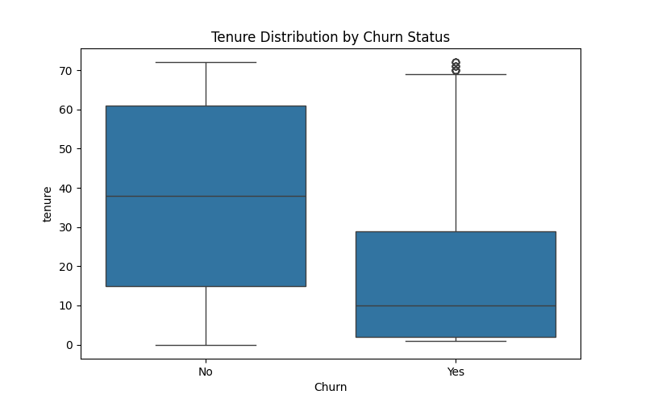
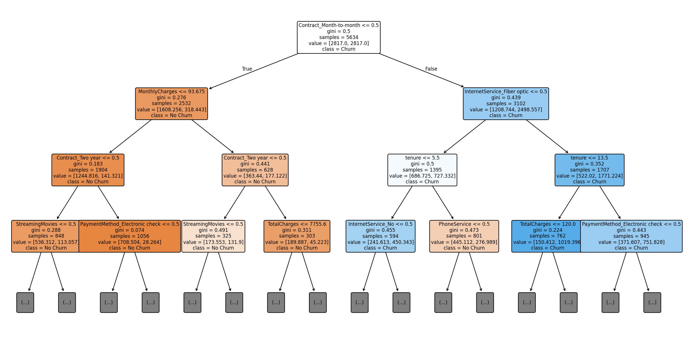

# Customer Churn Prediction

Predicting telecom customer churn using Logistic Regression and Decision Trees, with a focus on business-relevant evaluation under class imbalance.

## Problem Statement

Which customers are likely to churn, and what factors drive that risk, so that retention efforts can be targeted before a customer leaves? In this context, a **missed churner** (false negative) is costlier than a **false alarm** (false positive) — a missed churner is a lost customer with no chance of intervention, while a false alarm is a modest, low-cost retention offer sent to someone who wasn't actually leaving. This asymmetry shapes which metrics matter most below: **recall on the churn class is prioritized over raw accuracy.**

## Dataset

[IBM Telco Customer Churn](https://www.kaggle.com/datasets/blastchar/telco-customer-churn) — 7,043 customers, 21 original features covering demographics, account information (tenure, contract, billing), and subscribed services. Target: `Churn` (Yes/No), with a **26.5% churn rate** (moderately imbalanced).

## Approach

1. EDA — formed and tested three hypotheses on churn drivers (contract type, tenure, monthly charges) using grouped churn rates and box plots; identified and cleaned a data quality issue in `TotalCharges`.
2. Preprocessing — dropped the identifier column, binary-mapped Yes/No features, collapsed redundant "No internet/phone service" categories, one-hot encoded remaining categorical features (no dummy dropped — appropriate for trees, unlike logistic regression).
3. Baseline model — Logistic Regression (vanilla and class-weighted), with feature scaling.
4. Decision Tree — trained unconstrained (to demonstrate overfitting), then tuned via a train/validation accuracy-vs-depth curve to select `max_depth`, then compared vanilla vs. class-weighted versions.
5. **Evaluation** — precision/recall/F1/ROC-AUC across all five models, plus feature importance and a visualized tree for interpretability.

## Key Findings

- **Contract type is by far the strongest churn driver.** Month-to-month customers churn at **42.7%**, vs. 11.3% (one-year) and 2.8% (two-year) — a ~15x spread. This is confirmed both in EDA and by the trained tree, where `Contract_Month-to-month` accounts for **60.6% of total feature importance** and forms the root split.
- **Tenure and Contract type overlap heavily.** Newer customers are disproportionately on month-to-month plans; once the tree uses Contract, tenure's *additional* importance drops to just 11% despite looking like a strong standalone signal in EDA — a multicollinearity-like effect trees handle more gracefully than logistic regression would.
- **Customers who pay more tend to churn more** (median $79/mo for churners vs. $64/mo for retained customers) — the opposite of the initial "low cost drives loyalty" hypothesis.
- **Fiber optic internet service** emerged as a notable churn factor in the trained model, despite not being part of the original hypothesis set — worth further investigation.
- **An unconstrained decision tree overfits severely** (99.8% train accuracy vs. 73.7% test accuracy, ROC-AUC collapsing to 0.665) — pruning to `max_depth=5`, chosen via a validation curve, restored ROC-AUC to 0.834.

## Results

| Model | Churn Recall | Churn Precision | Accuracy | ROC-AUC |
|---|---|---|---|---|
| Logistic Regression (vanilla) | 0.56 | 0.66 | 0.81 | 0.842 |
| Logistic Regression (balanced) | 0.78 | 0.51 | 0.74 | 0.841 |
| Decision Tree (unconstrained) | 0.51 | 0.50 | 0.74 | 0.665 |
| Decision Tree (max_depth=5) | 0.58 | 0.63 | 0.80 | 0.834 |
| **Decision Tree (max_depth=5, balanced)** | **0.79** | 0.53 | 0.76 | 0.835 |

**Recommended model:** the balanced, pruned Decision Tree — it catches the most churners (79% recall, fewest missed at 78 out of 374) while remaining fully interpretable via `feature_importances_` and the visualized tree, at a modest cost in accuracy and precision relative to the unbalanced alternatives.

## Tech Stack

Python, pandas, scikit-learn, matplotlib, seaborn
